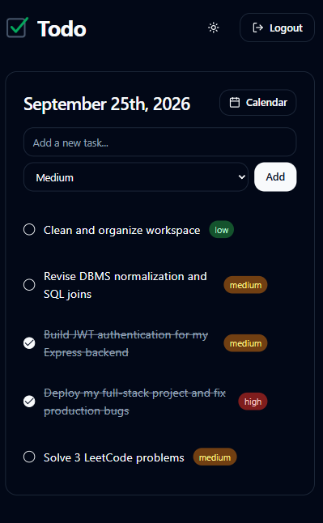

# Minimal Todo App

A sleek, minimalistic Todo application built with the MERN stack (Vite React, Express, MongoDB) featuring a beautiful Shadcn UI interface.

## Features
- **Calendar-Based Tasks:** Organize and track tasks by specific calendar dates.
- **Priority Tracking:** Categorize tasks by low, medium, and high priority.
- **Task Rollover:** Uncompleted tasks automatically roll over to the current day.
- **Dark/Light Mode:** Full theme support with a frosted glass toggle.
- **Google Authentication:** Secure login system using Google OAuth.

## Screenshots

<div align="center">
  
  <br/><br/>
  
  <br/><br/>
  
</div>

## Setup

1. **Install dependencies:**
   ```bash
   cd frontend && npm install
   cd ../backend && npm install
   ```

2. **Environment Variables:**
   Create `.env` in the `backend` folder:
   ```env
   MONGO_URI=mongodb+srv://<your-username>:<your-password>@<cluster-url>/todo-app
   GOOGLE_CLIENT_ID=your_google_client_id.apps.googleusercontent.com
   ```

   Create `.env.local` in the `frontend` folder:
   ```env
   VITE_GOOGLE_CLIENT_ID=your_google_client_id.apps.googleusercontent.com
   VITE_API_URL=http://localhost:5000/api
   ```

3. **Run the servers:**
   ```bash
   # In terminal 1
   cd frontend && npm run dev
   
   # In terminal 2
   cd backend && npm run dev
   ```