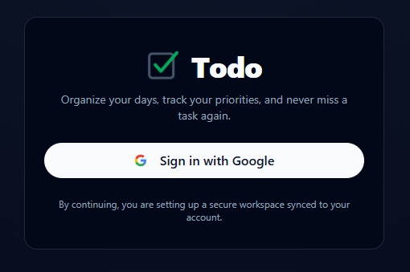
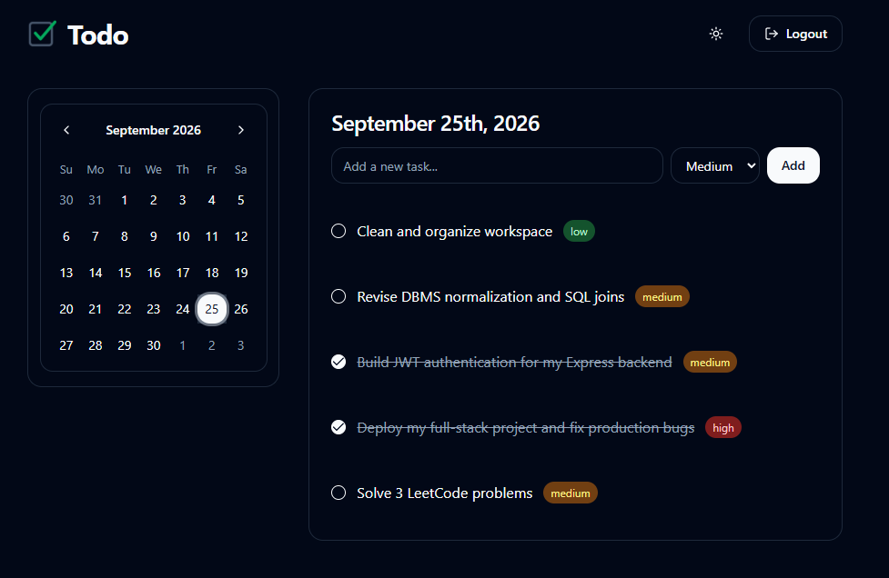
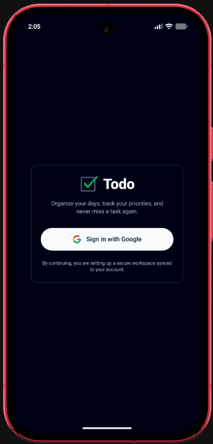
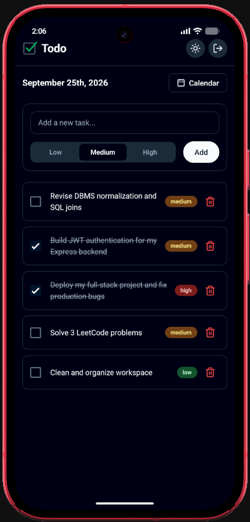

# Minimal Todo App

A sleek, universal Todo application built with the MERN stack (Express, MongoDB), featuring a beautiful Shadcn UI web application (Vite React) and a native Android application (React Native & Expo).

## Features
- **Cross-Platform:** Works on both web app and Android.
- **Calendar-Based Tasks:** Organize and track tasks by specific calendar dates.
- **Priority Tracking:** Categorize tasks by low, medium, and high priority.
- **Dark/Light Mode:** Full theme support across both web and mobile applications.
- **Google Authentication:** Secure, cross-platform login system using Google OAuth.

## Screenshots

### Web Application
<div align="center">
  
  <br/><br/>
  
  <br/><br/>
  
</div>

### Android Application
<div align="center">
  
  <br/><br/>
  
</div>

## Setup

### Backend (Required for both Web and Android)
1. **Install dependencies:**
   ```bash
   cd backend && npm install
   ```
2. **Environment Variables:**
   Create `.env` in the `backend` folder:
   ```env
   MONGO_URI=mongodb+srv://<your-username>:<your-password>@<cluster-url>/todo-app
   GOOGLE_CLIENT_ID=<your_web_google_client_id>.apps.googleusercontent.com
   ```
3. **Run the server:**
   ```bash
   cd backend && npm run dev
   ```

### Web Application
1. **Install dependencies:**
   ```bash
   cd frontend && npm install
   ```
2. **Environment Variables:**
   Create `.env.local` in the `frontend` folder:
   ```env
   VITE_GOOGLE_CLIENT_ID=<your_web_google_client_id>.apps.googleusercontent.com
   VITE_API_URL=http://localhost:5000/api
   *(Note: Update this to your deployed URL if testing a live backend).*
   ```
3. **Run the web app:**
   ```bash
   cd frontend && npm run dev
   ```

### Android Application
1. **Install dependencies:**
   ```bash
   cd mobile && npm install
   ```
2. **Environment Variables:**
   Create `.env` in the `mobile` folder:
   ```env
   EXPO_PUBLIC_GOOGLE_CLIENT_ID=<your_web_google_client_id>.apps.googleusercontent.com
   EXPO_PUBLIC_API_URL=http://10.0.2.2:5000/api
   ```
   *(Note: `10.0.2.2` points to localhost on your host machine when using the Android Emulator. Update this to your deployed URL if testing a live backend).*
3. **Run the mobile app:**
   ```bash
   cd mobile && npx expo run:android
   ```